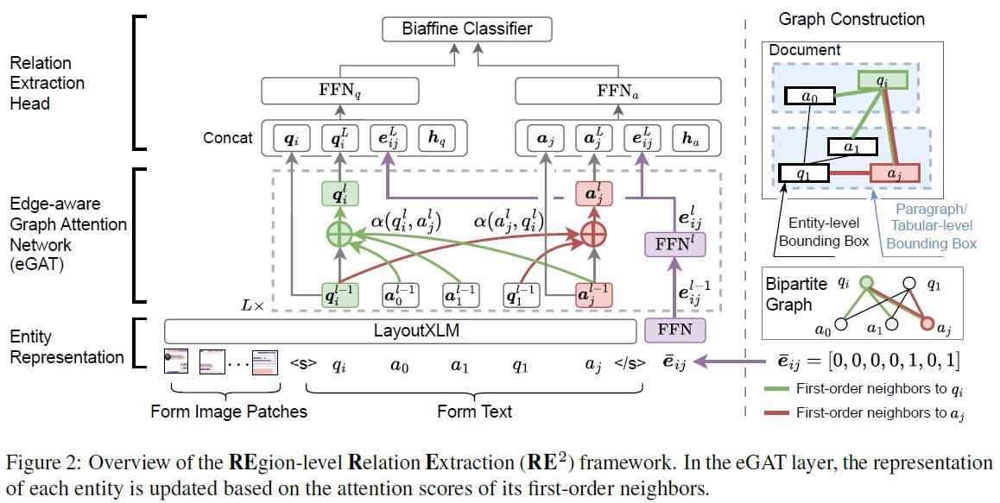

# RE<sup>2</sup> 

This is the official PyTorch implementation of RE<sup>2</sup>: Region-Aware Relation Extraction from Visually Rich Documents. [[arXiv](https://arxiv.org/abs/2305.14590)] 



## Installation

For CUDA 11.0
~~~bash
conda create -n re2 python=3.7
conda activate re2
git clone ###to insert git repo url##### (check if cd is required depending on what I am pushing as parent directory)
pip install -r requirements.txt
pip install -e .
~~~

For CUDA 11.X
~~~bash
conda create -n re2 python=3.7
conda activate re2
git clone ###to insert git repo url#####
pip install -r requirements_2.txt
pip install -e .
~~~

Or check [Detectron2](https://github.com/facebookresearch/detectron2/releases)/[PyTorch](https://pytorch.org/get-started/previous-versions/) versions and modify the requirements.txt file accordingly.

## Datasets
In this repository, we provide the fine-tuning codes for [FUNSD](https://guillaumejaume.github.io/FUNSD/), [XFUND](https://github.com/doc-analysis/XFUND) and our proposed dataset [<b>DiverseForm</b>](https://drive.google.com/uc?export=download&id=1VsOrSDMDtnYKCvemcKtlOvRj3utbXYVP).

For FUNSD, create a directory `FUNSD` and create two directories `funsd_test` and `funsd_train` under it. Each directory will have `annotations` and `images` folder.
```
├── FUNSD
│   ├── funsd_test
│   │   ├── annotations
|   |   ├── images
|   ├──funsd_train
|   |   ├── annotations
|   |   ├── images
```


## Available Paragraph/Tabular level region files
| Dataset            | Size  | Download             | 
| ---------------    | ----- | -------------------- |
| FUNSD              |       | [Download link](https://drive.google.com/uc?export=download&id=1KzMwxLb0_b0GqB4rrPenWyJhyX9P_LFH)    | 
| XFUND              |       | [Download link](https://drive.google.com/uc?export=download&id=1VpSApT8qmigj6JNyRmoyHfkhlg6vA3Vy)    |
| <b>DiverseForm</b> |       | [Download link](https://drive.google.com/uc?export=download&id=1k6VSwkwyJ5MqV054TaHFLvRcI_GjWNeT)    | 

Put the unzipped files to RE2 folder

## Creating custom Paragraph/Tabular region files
To create Paragraph level
~~~bash
python region_extraction/easyOCR.py \
--para true \
--ip_dir /path/to/folder/with/images \
--op_dir /path/to/folder/for/output
~~~
To create Line level
~~~bash
python region_extraction/easyOCR.py \
--para false \
--ip_dir /path/to/folder/with/images \
--op_dir /path/to/folder/for/output
~~~
To create Tabular level 
~~~bash
python region_extraction/table.py \
--ip_dir /path/to/folder/with/images \
--op_dir /path/to/folder/for/output
~~~
To combine both 
~~~bash
python region_extraction/combine.py \
--lang {en,pt...} \
--ip_path /path/to/folder/with/images \
--table /path/to/table.json \
--easy_para /path/to/easy_para.json \
--easy_line /path/to/easy_line.json \
--op_path /path/to/output/folder
~~~

Use just paragraph or combined region as fit. Rename file to `xfun_custom.json` and put it in `re2`

## Available Checkpoints

| Dataset (Language)| Size  | Download     | 
| ------------------| ------| -----        |
| FUNSD (EN)        |       | [Download link]() | 
| XFUND (ZH)        |       | [Download link]() |
| XFUND (JA)        |       | [Download link](https://drive.google.com/uc?export=download&id=1UCuS-yGlXeOpSCNQPys6fXOcPza4kMIN) |
| XFUND (ES)        |       | [Download link](https://drive.google.com/uc?export=download&id=1mCI4j62g-7IXz3Yml5b1azDGlOdN5Knb) |
| XFUND (FR)        |       | [Download link](https://drive.google.com/uc?export=download&id=1uuuwdG2kS9XiR0-fSxV0nGWH3_uakxIG) |
| XFUND (IT)        |       | [Download link](https://drive.google.com/uc?export=download&id=16xZL_KReSeIYExtiyoDJFPzLHQa_Vr2G) |
| XFUND (DE)        |       | [Download link]() |
| XFUND (PT)        |       | [Download link]() |
| <b>DiverseForm</b>|       | [Download link]() |


## Language specific fine-tuning on XFUND (for example, ZH)
~~~bash
CUDA_VISIBLE_DEVICES=0,1,2,3 python -m torch.distributed.launch --nproc_per_node=4 examples/run_xfun_re_inf.py \ 
--model_name_or_path microsoft/layoutxlm-base \
--output_dir path/to/output/directory \
--do_train \
--do_eval \
--lang zh \
--max_steps 5000 \
--per_device_train_batch_size 4 \
--warmup_ratio 0.1 \
--fp16
~~~

## Language specific fine-tuning on FUNSD 
~~~bash
CUDA_VISIBLE_DEVICES=0,1,2,3 python -m torch.distributed.launch --nproc_per_node=4 examples/run_xfun_re_inf.py \ 
--model_name_or_path microsoft/layoutxlm-base \
--output_dir path/to/output/directory \
--do_train \
--do_eval \
--lang en \
--path_to_dataset /path/to/dataset \
--max_steps 5000 \
--per_device_train_batch_size 4 \
--warmup_ratio 0.1 \
--fp16
~~~

## Language specific fine-tuning on <b>DiverseForm</b>
~~~bash
CUDA_VISIBLE_DEVICES=0,1,2,3 python -m torch.distributed.launch --nproc_per_node=4 examples/run_xfun_re_inf.py \ 
--model_name_or_path microsoft/layoutxlm-base \
--output_dir path/to/output/directory \
--do_train \
--do_eval \
--lang en \
--custom True \
--path_to_dataset /path/to/dataset \
--max_steps 5000 \
--per_device_train_batch_size 4 \
--warmup_ratio 0.1 \
--fp16
~~~

## Multitask fine-tuning on XFUND (for example, ZH)
~~~bash
CUDA_VISIBLE_DEVICES=0,1,2,3 python -m torch.distributed.launch --nproc_per_node=4 examples/run_xfun_re_inf.py \ 
--model_name_or_path microsoft/layoutxlm-base \
--output_dir path/to/output/directory \
--do_train \
--do_eval \
--lang zh \
--additional_langs en+de+es+pt+it+fr+ja
--max_steps 5000 \
--per_device_train_batch_size 4 \
--warmup_ratio 0.1 \
--fp16
~~~

## Run inference from a model checkpoint
~~~bash
CUDA_VISIBLE_DEVICES=0,1,2,3 python -m torch.distributed.launch --nproc_per_node=4 examples/run_xfun_re_inf.py \
--model_name_or_path /path/to/model_checkpoint \
--path_to_dataset /path/to/dataset \
--output_dir path/to/output/directory \
--do_predict
~~~

Folder directory of path to data that requires inference is as follows:
```
├── DATA
│   ├── annotations
|   ├── images
```
Refer to `sample_inference` folder for a sample of required data
